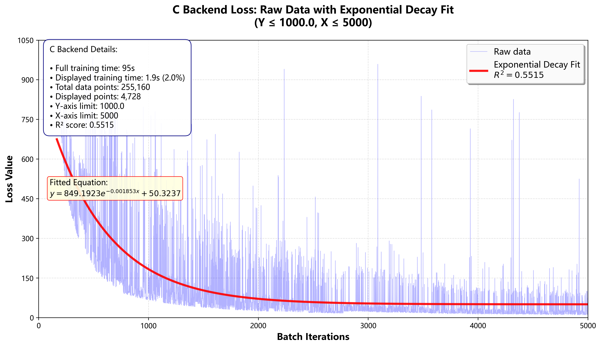
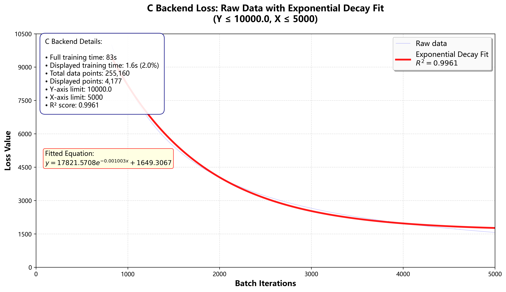
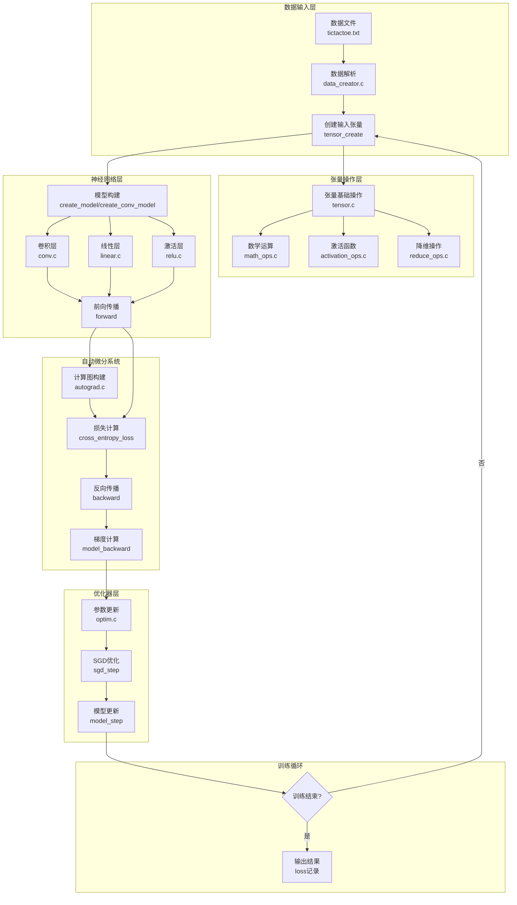

# TinyTorch

TinyTorch 是一个用纯 C 语言编写的轻量级深度学习框架。它从零实现了张量运算、自动微分、神经网络层和优化器，旨在帮助理解深度学习框架的底层原理。

## 📚 项目简介

本项目通过实现一个微型深度学习框架，展示了如何从底层构建神经网络训练所需的各个组件。项目包含完整的张量运算库、自动微分系统、常用神经网络层（全连接层、卷积层）以及优化器。

### 🎯 项目目标
- 深入理解深度学习框架的核心机制
- 掌握张量运算和自动微分的实现原理
- 学习神经网络层和优化器的底层实现
- 为理解 PyTorch、TensorFlow 等主流框架打下基础

### ✨ 主要特点
- **纯 C 语言实现**：不依赖任何第三方深度学习库，完全从零构建
- **模块化设计**：清晰地划分了张量操作、自动微分、神经网络层和优化器等模块
- **自动微分**：实现了动态计算图，支持反向传播自动计算梯度
- **示例丰富**：包含井字棋数据集生成、全连接网络和卷积神经网络训练示例
- **易于学习**：代码结构清晰，注释详细，适合学习和研究

### 🎓 适合人群
- 想要深入理解深度学习框架底层原理的学习者
- C 语言爱好者，希望用 C 语言实现深度学习算法的开发者
- 研究深度学习框架实现的研究人员和工程师

## 📂 项目结构

```
TinyTorch/
├── README.md                  # 项目说明文档
├── CMakeLists.txt            # CMake 构建配置
├── find.py                   # 辅助脚本，用于查找文件
├── include/                  # 头文件目录
│   ├── tensor.h              # 张量操作接口
│   ├── autograd.h            # 自动微分接口
│   ├── nn.h                  # 神经网络层接口
│   └── optim.h               # 优化器接口
├── src/                      # 源代码目录
│   ├── tensor.c              # 张量数据结构及基础操作
│   ├── autograd.c            # 自动微分核心实现
│   ├── optim.c               # 优化器实现 (SGD)
│   ├── nn/                   # 神经网络层实现
│   │   ├── linear.c          # 全连接层 (Linear)
│   │   ├── conv.c            # 卷积层 (Conv2d)
│   │   ├── relu.c            # ReLU 激活层
│   │   ├── softmax.c         # Softmax 层
│   │   └── cross_entroy.c    # 交叉熵损失函数
│   ├── operations/           # 张量运算操作
│   │   ├── math_ops.c        # 基础数学运算 (加减乘除、矩阵乘)
│   │   ├── activation_ops.c  # 激活函数运算
│   │   └── reduce_ops.c      # 降维运算
│   └── examples/             # 示例代码
│       ├── data_creator.c    # 生成井字棋数据集 (tictactoe.txt)
│       ├── example_1/        # 示例 1: 全连接网络
│       │   ├── main.c        # 主程序入口
│       │   ├── run_1.c       # 训练逻辑
│       │   └── compare.py    # Python 对比脚本
│       └── example_2/        # 示例 2: 卷积神经网络
│           ├── main.c        # 主程序入口
│           ├── run_2.c       # 训练逻辑
│           └── compare.py    # Python 对比脚本
└── docs/                     # 文档目录
    ├── demo_1.png            # 示例 1 训练结果
    └── demo_2.png            # 示例 2 训练结果
```

## 🔧 核心功能模块

### 1. 张量操作层 (`tensor.c`, `operations/`)

提供多维数组（张量）的基础数据结构及数学运算支持。

#### 数据结构
```c
typedef struct _tensor {
    float* data;              // 张量数据
    int* shape;               // 张量形状
    int ndim;                 // 张量维度
    int size;                 // 张量元素总数
    int requires_grad;        // 是否需要计算梯度
    struct _tensor* grad;     // 梯度张量
} Tensor;
```

#### 主要功能
- **基础操作**：创建、销毁、打印、形状变换（`squeeze`, `transpose`）
- **数学运算**：逐元素加减乘除、矩阵乘法（`matmul`）、标量乘法
- **激活函数**：ReLU, Sigmoid, Tanh 等前向及反向计算
- **降维操作**：Sum, Mean, Softmax 等
- **张量操作**：重复（`repeat`）、克隆（`clone`）、拼接（`cat`）等

### 2. 自动微分系统 (`autograd.c`)

实现了基于动态计算图的自动微分机制，支持前向传播和反向传播。

#### 计算图结构
```c
typedef struct _operation {
    LAYERTYPE layer_type;     // 层类型
    void* params;             // 层参数
    Tensor* input;            // 输入张量
    struct _operation* next_op;   // 下一层
    struct _operation* last_op;   // 上一层
} Operation;
```

#### 主要功能
- **计算图构建**：在前向传播过程中记录操作历史
- **前向传播**：`model_forward()` - 执行整个模型的前向传播
- **反向传播**：`model_backward()` - 自动计算损失函数对各个参数的梯度
- **梯度管理**：支持梯度清零和累积

### 3. 神经网络层 (`nn/`)

提供了构建神经网络所需的基础组件。

#### 全连接层 (`linear.c`)
```c
typedef struct _linearlayer {
    Tensor* weight;           // 权重矩阵
    Tensor* bias;             // 偏置向量
    int in_features;          // 输入特征数
    int out_features;         // 输出特征数
} LinearLayer;
```
实现线性变换 $y = xA^T + b$，支持前向传播、反向传播和参数更新。

#### 卷积层 (`conv.c`)
```c
typedef struct _convlayer {
    Tensor* weight;           // 卷积核
    int kernel_size;          // 卷积核大小
    int stride;               // 步长
    int padding;              // 填充
} ConvLayer;
```
实现 2D 卷积操作，支持前向传播、反向传播和参数更新。

#### 其他层
- **激活层** (`relu.c`, `softmax.c`)：封装了激活函数
- **损失函数** (`cross_entroy.c`)：实现了交叉熵损失

### 4. 优化器 (`optim.c`)

实现了参数更新逻辑。

#### SGD (随机梯度下降)
- `sgd_step()` - 对单个层执行 SGD 更新
- `model_step()` - 对整个模型执行 SGD 更新

## 🚀 快速开始

### 环境要求

- **编译器**：
  - GCC 7.0+ 或 Clang 5.0+
  - MSVC 2017+ (Windows)
- **构建工具**（可选）：
  - CMake 3.10+
  - Make (Linux/macOS)
  - Ninja (可选，更快的构建)

### 获取项目

```bash
git clone https://github.com/yourusername/TinyTorch.git
cd TinyTorch
```

### 编译与运行

#### 方法 1: 使用 CMake (推荐)

```bash
# 创建构建目录
mkdir build && cd build

# 配置项目
cmake ..

# 编译
cmake --build .

# 运行示例
./my_program
```

#### 方法 2: 使用 GCC 直接编译

**Linux/macOS:**
```bash
gcc src/examples/example_2/main.c src/examples/example_2/run_2.c \
    src/tensor.c src/nn/*.c src/autograd.c src/optim.c \
    -I include -lm -o example_2
./example_2
```

**Windows (使用 MSVC):**
```cmd
cl src\examples\example_2\main.c src\examples\example_2\run_2.c ^
    src\tensor.c src\nn\*.c src\autograd.c src\optim.c ^
    /I include /Fe:example_2.exe
example_2.exe
```

### 示例说明

#### 示例 1: 全连接网络 (井字棋分类)

该示例使用全连接神经网络对井字棋的棋盘状态进行分类（胜/负/平）。

**网络架构:**
- 输入层：9 维（3x3 棋盘）
- 隐藏层：16 个神经元，ReLU 激活
- 输出层：4 个神经元（对应 P/N/M/Q 四种状态）

**运行步骤:**

1. **生成数据**:
   ```bash
   gcc src/examples/data_creator.c -o data_creator
   ./data_creator
   ```
   这将生成 `tictactoe.txt` 数据文件，包含所有可能的井字棋棋盘状态。

2. **编译并运行训练**:
   ```bash
   gcc src/examples/example_1/main.c src/examples/example_1/run_1.c \
       src/tensor.c src/nn/*.c src/autograd.c src/optim.c \
       -I include -lm -o example_1
   ./example_1
   ```

3. **查看结果**:
   训练过程中会生成 `loss_c.txt` 文件，记录训练损失的变化。

4. **对比结果** (可选):
   项目提供了 Python 脚本 `compare.py`，用于对比 C 实现与 PyTorch 实现的输出结果。
   ```bash
   cd src/examples/example_1
   python compare.py
   ```

**训练参数:**
- 学习率：0.001
- 训练轮数：10 epochs
- 优化器：SGD

**预期结果:**


#### 示例 2: 卷积神经网络

该示例展示了如何构建和训练一个简单的 CNN。

**网络架构:**
- 卷积层：1 个输入通道，4 个输出通道，3x3 卷积核，步长 1，无填充
- ReLU 激活层
- 全连接层：4 个输出神经元

**运行步骤:**

1. **编译并运行**:
   ```bash
   gcc src/examples/example_2/main.c src/examples/example_2/run_2.c \
       src/tensor.c src/nn/*.c src/autograd.c src/optim.c \
       -I include -lm -o example_2
   ./example_2
   ```

2. **查看结果**:
   训练过程中会生成 `loss_conv.txt` 文件，记录训练损失的变化。

**训练参数:**
- 学习率：0.001
- 训练轮数：10 epochs
- 优化器：SGD

**预期结果:**


## 📊 架构图

TinyTorch 的训练流程架构如下：



## 💡 API 使用指南

### 创建张量

```c
#include "tensor.h"

// 从数据创建张量
float data[] = {1.0f, 2.0f, 3.0f, 4.0f};
int shape[] = {2, 2};
Tensor* t = tensor_create(data, shape, 2);

// 创建全零张量
Tensor* zeros = tensor_zeros(shape, 2);

// 创建全一张量
Tensor* ones = tensor_ones(shape, 2);

// 创建随机张量
Tensor* rand = tensor_rand(shape, 2, 0, 1);
```

### 构建模型

```c
#include "nn.h"
#include "autograd.h"

// 创建全连接层
LinearLayer* fc1 = linear_create(9, 16);
LinearLayer* fc2 = linear_create(16, 4);

// 创建卷积层
ConvLayer* conv = conv_create(1, 4, 3, 1, 0);

// 构建模型
Operation* model = create_model(fc1, fc2);
```

### 训练循环

```c
#include "optim.h"

// 前向传播
Tensor* output = model_forward(model, input);

// 计算损失
float loss = cross_entropy_loss(output, target);

// 反向传播
model_backward(model, output->grad);

// 更新参数
model_step(model, learning_rate);
```

## 📖 学习路径建议

1. **张量基础**
   - 阅读 `tensor.c` 和 `tensor.h`
   - 理解张量的数据结构和基本操作
   - 尝试创建和操作张量

2. **自动微分**
   - 阅读 `autograd.c` 和 `autograd.h`
   - 理解计算图的构建和反向传播
   - 追踪梯度的计算过程

3. **神经网络层**
   - 阅读 `nn/` 目录下的各个层实现
   - 理解前向传播和反向传播的数学原理
   - 尝试实现新的层

4. **优化器**
   - 阅读 `optim.c` 和 `optim.h`
   - 理解参数更新的原理
   - 尝试实现新的优化器（如 Adam）

5. **实践项目**
   - 运行示例代码
   - 修改网络结构和参数
   - 尝试解决自己的问题

6. **自定义网络架构**
   - 复制示例中的 `run.c` 文件（如 `run_1.c` 或 `run_2.c`）
   - 修改 `create_model()` 函数，按照自己的需求构建网络
   - 可以组合不同的层（Linear、Conv、ReLU 等）
   - 调整各层的参数（如输入/输出维度、卷积核大小等）

## 🔍 故障排除

### 编译问题

**问题**: 找不到头文件
```bash
fatal error: tensor.h: No such file or directory
```
**解决方案**: 确保使用 `-I include` 参数指定头文件路径

**问题**: 链接错误
```bash
undefined reference to `tensor_create`
```
**解决方案**: 确保所有源文件都包含在编译命令中

**问题**: Windows 下编译失败
**解决方案**: 使用 MSVC 或 MinGW，并调整编译参数

### 运行时问题

**问题**: 文件打开失败
```bash
file open error
```
**解决方案**: 确保 `tictactoe.txt` 文件存在于当前目录

**问题**: 内存泄漏
**解决方案**: 确保使用 `tensor_free()` 释放不再需要的张量


---

本项目是一个学习项目，旨在帮助理解深度学习框架的底层实现。代码仅供学习和研究使用。

作者：浙江大学学生 绿意不息
日期：2026年2月25日